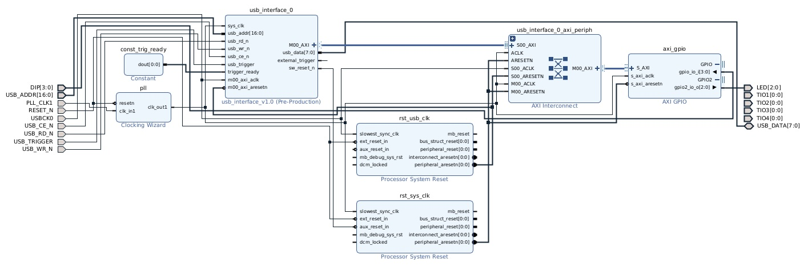

## Create template project

This repository provides a tcl script to create a Vivado project for CW305 shell.

1. Clone the repository

2. Run the following command to launch Vivado and create a project.

```bash
vivado -source vivado/init-shell-project.tcl
```

The following options are available for tclargs
* --project-dir <path>: Specify the project directory (default: ./proj_shell)
* --project-name <name>: Specify the project name (default: proj_shell)

## Generated block design

The template block design includes the following components:
* Interface module: which receives some command from host PC and convert read/write request to AXI4-Lite protocol
* Clocking Wizard: which generates system clock (20MHz default) from on-board PLL clock (100MHz)
* AXI GPIO: which provides GPIO interface to control LEDs and get DIP switch status

USB trigger signal from the microcontroller is synchronized with the system domain clock and make one-cycle pulse to the cryptographic module.
Please note that use of the trigger signal is optional.
Considering the cryptographic module is busy sometimes, the trigger pulse is pending until the module is ready.
The ready signal is hardwired to 1 in the template design by the Constant IP.
Please change the signal connection according to your design.



